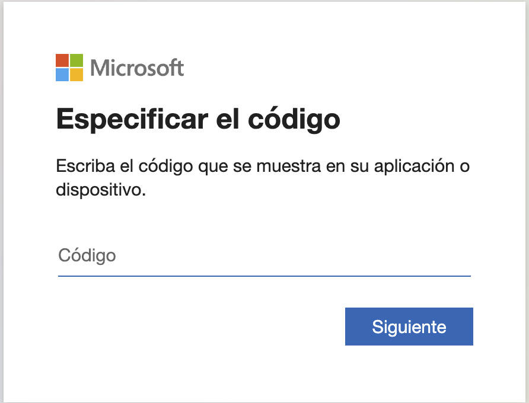

En mundos tan cambiantes y tecnologicos como en el que estamos viviendo, es importante aprender diferentes aplicaciones y herramientas que nos pueden agilizar y ayudar en nuesytro dia a dia.
Estamos en una industria en la que cada dia, es un dia nuevo, con nuevas formas de trabajar, nuevos caminos para desarrollar y mucho que aprender.
Por eso es tan importante, obtener y limpiar esos datos como saber entregarlos a nuestro publico objetivo.
Ahi, es donde las diferentes herramientas del BI nos van a ayudar y ahora es el momento de empezar a aprender.

Os voy a entregar un codigo de Python, en la extension Jupyter, con la que rapidamente podemos sacar una vision de nuestros datos y poder empezar a obtener insights, con los que posteriormente podremos trabajar mas detenidamente.

## Como crear un correo de empresa 

El proceso es tan simple como rapido, y lo primero de todo, tenemos que crearnos una "cuenta de empresa" con Microsoft, hay diferentes fuentes donde puedes ver tutoriales para hacerlo de una forma mas rapida.

Lo mas importante, es guardar tu nombre de usuario y contraseña(obviamente), porque lo vamos a utilizar seguidamente.



## Como crear un reporte en Jupyter Notebook

Una vez que tengamos una cuenta y seamos usuarios de Microsoft con cuenta de empresa, podemos ya trabajar en nuestro Jupyter Notebook.
1 STEP:

Seguidamente, vamos a importar o leer nuestro dataset 

2 STEP: 

Autentificamos nuestro usuario y conectamos los servidores Jupyter con Power BI
```
from powerbiclient import QuickVisualize, get_dataset_config, Report
from powerbiclient.authentication import DeviceCodeLoginAuthentication

import pandas as pd
```

3 STEP:

Llamamos al dataset que previamente hemos obtenido en la primera celda y generamos un dashboard con Power BI.

```
# Create a Power BI report from your data
PBI_visualize = QuickVisualize(get_dataset_config(df), auth=device_auth)

# Render the new report
PBI_visualize
```

4 STEP

Con esto, vamos a obtener un dashboard iteractivo donde podemos elegir el tipo de grafico que queremos, el tipo de datos que queremos visualizar, la cantidad de datos, y la forma de visualizarlo, en resumida, con esta herramienta, tenemos una vision rapida de nuestos datos y ver donde podemos atacarlos.


# Herramientas de Business Intelligence (BI) para la Visualización de Datos
En el mundo actual, caracterizado por rápidos cambios tecnológicos, es fundamental adquirir habilidades en diversas aplicaciones y herramientas que puedan agilizar y mejorar nuestras actividades diarias. Especialmente en industrias en constante evolución, donde cada día trae consigo nuevas formas de trabajo y oportunidades de desarrollo, es crucial saber cómo obtener y limpiar datos, así como presentarlos de manera efectiva a nuestro público objetivo. En este sentido, las herramientas de Business Intelligence (BI) desempeñan un papel clave.

En este repositorio, te presentamos un código en Python utilizando Jupyter Notebook, que te permitirá obtener rápidamente una visión general de tus datos y comenzar a obtener información valiosa, sobre la cual podrás trabajar más detenidamente.

## Cómo crear una cuenta de correo empresarial
El primer paso es crear una "cuenta de empresa" en Microsoft. Existen varios tutoriales disponibles en línea que te guiarán en este proceso de manera rápida y sencilla. Es importante que guardes tu nombre de usuario y contraseña, ya que los necesitarás en los pasos siguientes.

## Cómo crear un informe en Jupyter Notebook
Una vez que tengas una cuenta de Microsoft para empresas y seas usuario de Jupyter Notebook, podrás empezar a trabajar en tu informe. Sigue estos pasos:

Paso 1: Importar o leer el conjunto de datos

```python
from powerbiclient import QuickVisualize, get_dataset_config, Report
from powerbiclient.authentication import DeviceCodeLoginAuthentication
import pandas as pd
```
Paso 2: Autenticar tu usuario y conectar los servidores de Jupyter con Power BI

makefile
Copy code
# Autenticación del dispositivo de usuario

```python 

device_auth = DeviceCodeLoginAuthentication()
```
# Conexión a los servidores de Power BI
``` python 
device_auth.login()
```
Paso 3: Llamar al conjunto de datos y generar un panel de control con Power BI

bash
Copy code
# Crear un informe de Power BI a partir de tus datos
``` python
PBI_visualize = QuickVisualize(get_dataset_config(df), auth=device_auth)

```

# Mostrar el nuevo informe
PBI_visualize
Paso 4: Explorar y visualizar tus datos
Con estos pasos, obtendrás un panel de control interactivo en el que podrás elegir el tipo de gráfico, los datos que deseas visualizar, la cantidad de datos y la forma de presentarlos. En resumen, esta herramienta te proporciona una visión rápida de tus datos y te ayuda a identificar áreas clave en las que puedes enfocarte.

¡No esperes más! Aprovecha las herramientas de Business Intelligence para obtener información valiosa de tus datos y tomar decisiones informadas. Con este código en Jupyter Notebook y Power BI, podrás visualizar y analizar tus datos de manera efectiva, optimizando así tu trabajo y resultados.

## Contribuciones
Si deseas contribuir a este proyecto, ¡estás más que bienvenido! Puedes enviar tus sugerencias, mejoras o correcciones a través de solicitudes de extracción. Juntos, podemos hacer de este repositorio un recurso aún más valioso para la comunidad.
